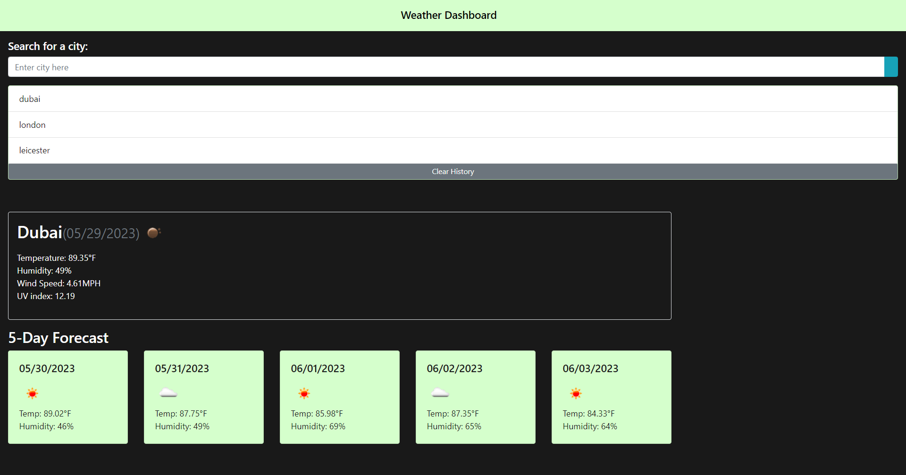

# Weather Dashboard

## Project Description 

This project involved creating a Weather Dashboard which features the Open Weather 5 day Weather Forecast API to retrieve weather data for cities. Local Storage will be used to store previous searches.

# Usage

1. In order to run the application, click on the deployed application link.

2. Once you have been redirected to the web-page, click the search bar,type a city of your choice in and press the search button.

3. You will be presented with the current temperature, humidity, wind speed and UV Index for the present day.

4. Below the current day, you will be presented with the weather forecast for the following 5 days alongside icons to describe the weather.

# Links
[Click here to access the deployed website.](https://fadumaabdi.github.io/passwordGenerator/index.html)

[Click here to access the files on the github repository.](https://github.com/fadumaabdi/passwordGenerator)

